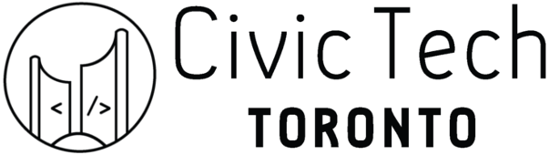

# Overview

🎈 A experimental effort to coordinate meetup resources through GitHub.

## Table of Contents
- [Community Infrastructure](#community-infrastructure)
- [Resources](#resources)

## Community Infrastructure

Community and operations infrastructure that support both our internal and outreach processes.

| **Legend** |
|:-----------|
| :microscope: Unofficial/Experimental |
| :pray: Self-hosted |

| | Tool Name | Description |
|-|-----------|-------------|
| :pray: | [**`hubot-toby`**](https://github.com/CivicTechTO/hubot-toby) | Custom chat bot who lives in our slack |
| :pray: | [**`civictechto-slack-invite`**](https://github.com/CivicTechTO/civictechto-slack-invite) | Small app for public Slack sign-up |
| :pray::microscope: | [**`prog-channels`**][prog-channels] | Tool to sync Slack channel list to a public Airtable |
| :pray: | [**`matterbridge-heroku`**](https://github.com/edgi-govdata-archiving/matterbridge-heroku) | Tool to help bridge chat channels between Slacks |

## Resources

This is a list of resources that are available.

### Operations

* [**Service & Access Inventory.**][service-inventory] For tracking what
  services we use, and who has access to what.
* [**Google Drive folder.**][gdrive] For storing all resources related to
  operations of Civic Tech Toronto.
* [**Slack Channel List.**][channels] An auto-updated and categorized
  list of channels for curious folks who haven't yet signed up for
  Slack.
* [**Member attendance count list.**][member-list] Ethercalc spreadsheet
  updated daily from public data on Meetup.com.

<!-- Links -->

   [service-inventory]: https://hackmd.io/s/SJcySi2db
   [gdrive]: https://drive.google.com/drive/folders/0B4jGklalvuvwfjhLekdZdUZKNTN6UlVvdGNjSUZjYU50YXlCMUh5emI1SmhxNWZKU3Q2MXc
   [channels]: https://airtable.com/shrPfXyBSKIu8k49P/tbldBIVlA6XtUMtQW
   [member-list]: https://ethercalc.org/civictechto-members
   [prog-channels]: https://github.com/civictechto/prog-channels
